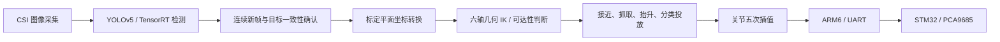

# 净境先锋 - 基于 ROS 2 的智能垃圾拾取机器人

面向办公与公共空间的垃圾识别、视觉定位、机械臂抓取与分类投放项目，采用 **Jetson Orin NX + STM32F103ZET6** 主从架构，结合 ROS 2、YOLOv5、几何逆运动学、关节轨迹和 UART 控制；Web 端通过 MQTT 提供远程交互。

**项目背景**：大学生物联网应用创新设计竞赛 / 大学生创新训练项目。

仓库提供六轴运动学与抓取控制、YOLOv5 / TensorRT 推理接口、部署工具和自动化测试，同时兼容四轴样机。连杆尺寸、关节限位与分类桶位置由配置文件统一管理。

<p align="center">
  
  
</p>

## 运动控制与视觉执行链



### 六轴几何逆运动学与可达性

- `six_axis.py`：针对 **Z-Y-Y 定位臂 + Z-Y-Z 球形腕**，进行腕心分离、肩部和肘部几何求解、腕部姿态分解。
- 枚举肩部、肘部与腕部候选解，检查关节限位，以 FK 复核目标位姿，并按相对当前指令位置的关节行程选解。
- 腕部奇异时尝试保留种子关节角，并检查限位端点；不可达目标返回失败。
- 几何尺寸、关节限位、待机姿态、分类桶位置均可配置。**不适用于任意六轴构型，也不包含碰撞检测。**
- 保留 `ik_service.py` 四轴原型求解器，`arm_dof: 4` 可选择历史模式。

### 轨迹与抓取调度

- 四／六关节同步五次插值，按最大速度与加速度确定轨迹时长。
- 抓取前检查所有路径点的 IK；执行接近、夹取、抬升、分类投放、返回流程。
- ROS 2 异步服务协调检测暂停、坐标转换、抓取与恢复，避免嵌套执行器等待。
- `ARM` 与 `ARM6` 独立编码；六轴使用 PCA9685 通道 0、1、2、3、4、6，通道 5 留给夹爪。
- 默认 `dry_run: true`：计算路径与命令，不驱动硬件。UART 写入成功仅代表发送完成，不代表关节到位或抓取成功。

### 视觉定位与 TensorRT 部署

- 支持原版 YOLOv5 的 `.pt` / `.engine` 模型；另提供 Ultralytics 模型适配器，按训练框架显式选择。
- 检测线程消费最新图像，每张图像最多处理一次，保留相机时间戳；连续目标确认检查类别和空间一致性。
- 透视标定输出基座平面 X/Y，Z 由抓取平面高度配置，不将平面单应性描述为通用深度重建。
- 提供 FP16 TensorRT 导出与视频基准测试脚本，记录实际平均吞吐率、P95/P99 延迟和逐帧 CSV。
- 权重、TensorRT 引擎和标定矩阵需自行提供；性能报告由基准测试工具生成。

## 软件与硬件

| 层级 | 组件 / 状态 |
|---|---|
| 上位机 | Jetson Orin NX，ROS 2 Humble；实际系统需匹配 JetPack、CUDA、TensorRT |
| 下位机 | STM32F103ZET6、FreeRTOS、PCA9685、UART 115200 bps |
| 六轴控制 | Z-Y-Y 定位臂 + Z-Y-Z 球形腕；连杆、零位、方向和限位可配置 |
| 原型硬件 | 四轴机械臂、夹爪、差速底盘、升降机构、CSI 摄像头 |
| Web | MQTT 状态订阅与控制发布；完整机器人端 MQTT 桥接尚未包含 |
| 换桶 | 固件有升降换桶动作；自主导航至换桶站、满溢感知闭环仍需集成验证 |

<p align="center">
  
</p>

## 无硬件测试

在仓库根目录运行，Python 环境需要 NumPy，串口 C 测试需要 GCC：

```bash
python -m pip install numpy
python -m unittest discover -s tests -v
```

测试包含 300 组随机位姿的 FK/IK 往返校验、已知位姿、奇异腕姿态、关节限位、轨迹速度与加速度、连续目标确认，以及编译执行的固件串口分包测试。GitHub Actions 同时执行 ROS 2 Humble 构建与服务接口集成检查。

## ROS 2 构建与试运行

在匹配 ROS 2 Humble 的环境中，将仓库放到工作空间 `src` 下，并安装声明的依赖：

```bash
cd ~/robot_ws
source /opt/ros/humble/setup.bash
rosdep install --from-paths src --ignore-src -r -y
colcon build --symlink-install
source install/setup.bash
ros2 launch robot_launch arm.py
```

默认六轴计算模式不打开串口。另一个已加载工作空间的终端可以发送：

```bash
ros2 service call /arm_control interfaces/srv/ArmControl "{type: fetch, x: 12.0, y: 0.0, z: 0.0, roll: 0.0, pitch: 180.0, yaw: 0.0, class_name: dry}"
```

完整视觉流程需要实际相机、模型及标定文件：

```bash
ros2 launch robot_launch start.py config:=/absolute/path/robot.yaml
```

真实运动前，按[部署指南](docs/deployment-guide.md)校准配置与固件，再开启串口。`ArmControl.srv` 新增姿态与分类字段，上下游必须重新构建。

## TensorRT 导出与基准测试

在目标 Jetson 上，用与训练模型相匹配的本地 YOLOv5 仓库：

```bash
python tools/export_tensorrt.py --weights /absolute/path/best.pt --yolov5-repo ~/yolov5
python tools/benchmark_detection.py --model /absolute/path/best.engine --video /absolute/path/test.mp4 --yolov5-repo ~/yolov5 --frames 300
```

结果写入 `output/benchmark.json` 和 `output/benchmark.csv`，该测试不包括视频解码、ROS 通信与显示。实时链路帧率仍需在目标系统测量。具体环境和两种模型系列的区别见 [TensorRT 部署说明](docs/tensorrt-deployment.md)。

## 目录

| 路径 | 内容 |
|---|---|
| `robot_arm/robot_arm/` | 六轴 FK/IK、历史四轴 IK、轨迹与抓取服务 |
| `robot_vision/robot_vision/` | 相机、YOLO 推理适配、平面标定定位 |
| `robot_core/robot_core/` | 连续帧确认与异步抓取状态调度 |
| `robot_serial/` | UART 发送服务 |
| `robot_launch/config/robot.yaml` | 默认运行参数 |
| `interfaces/` | ROS 2 消息与服务 |
| `firmware/` | STM32 下位机、串口解析与舵机执行 |
| `tools/` | TensorRT 导出、基准测试与 ROS 集成检查 |
| `tests/` | 软件与串口测试 |
| `web/`、`media/` | Web 界面与原型展示素材 |

## 文档

- [系统设计与坐标约定](docs/system-design.md)
- [功能范围与验证状态](docs/functional-requirements.md)
- [部署指南](docs/deployment-guide.md)
- [UART 协议](docs/uart-protocol.md)
- [TensorRT 部署与性能测量](docs/tensorrt-deployment.md)

## License

见 [LICENSE](LICENSE)。模型与外部推理框架遵循各自许可证。
