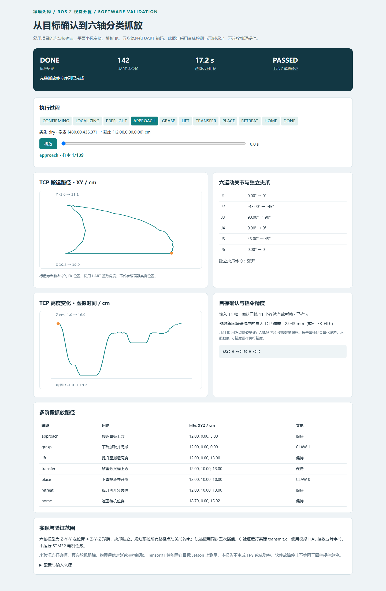
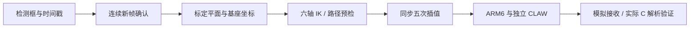

# 净境先锋 · 基于 ROS 2 的智能垃圾拾取机器人

面向办公与公共空间的视觉识别、目标定位、机械臂抓取与分类投放项目。采用 **Jetson Orin NX + STM32** 协同架构，集成 ROS 2、YOLOv5 / TensorRT、六轴几何运动学、关节轨迹与 UART 控制，配套 Web MQTT 交互界面。

## 机器人实物

| 整机与机械臂 | 底盘、分类桶与升降机构 |
|:---:|:---:|
|  |  |

**软件演示：连续目标确认 → 基座坐标转换 → 六轴 FK/IK → 多阶段分类抓放 → 五次插值 → UART 指令 → 固件解析验证。**

## 一分钟运行软件演示

```bash
python -m pip install -r showcase/requirements.txt
python -m showcase.demo
```

打开生成的 `output/showcase/demo.html`，可播放或拖动 TCP 路径，查看六关节角、独立夹爪、阶段切换和整数角度编码误差。JSON 保存输入来源、完整配置、目标确认记录、轨迹及串口指令。

有主机 GCC 时，加上实际固件解析验证：

```bash
python -m showcase.demo --firmware-check
```

这会编译 `firmware/Core/Src/transmit.c`，将整条命令流按 7 字节分片送入模拟 HAL，检查实际 C 解析结果与发送内容逐帧一致。默认不连接物理串口、不运行电机任务。

<details><summary>展开交互报告预览</summary>



</details>

演示目标、连续检测帧和标定矩阵均为标注的合成样例；六轴尺寸、限位和桶位为可替换的软件示例。数学位姿、指令估计和实测反馈分别处理，不把模拟成功当作实物抓取成绩。

## 当前能力与入口

| 能力 | 实现 | 入口 |
|---|---|---|
| 系统集成 | ROS 2 异步服务协调检测、定位和抓取；Jetson / STM32 通过 UART 分工 | [任务调度](robot_core/robot_core/confirm.py)、[机械臂服务](robot_arm/robot_arm/arm_control.py) |
| 六轴 FK/IK | Z-Y-Y 定位臂 + Z-Y-Z 球腕，枚举多解、限位过滤、FK 复核及种子选解 | [运动学](robot_arm/robot_arm/six_axis.py) |
| 视觉定位与确认 | 类别/位置一致性、重复与乱序帧过滤、单应变换及基座平面坐标 | [目标确认](robot_core/robot_core/target_gate.py)、[坐标几何](robot_vision/robot_vision/plane_geometry.py) |
| 分类抓放 | 接近、抓取、提升、转运、投放、离桶、回位；夹爪独立 | [共用规划器](robot_arm/robot_arm/grasp_plan.py) |
| 轨迹与执行 | 同步五次关节插值，按速度/加速度约束定时；ARM6 编码 | [轨迹](robot_arm/robot_arm/move_joints.py)、[软件执行链](showcase/pipeline.py) |
| UART / MCU | CRLF 帧、DMA 分片重组、指令解析、独立夹爪通道 | [解析器](firmware/Core/Src/transmit.c)、[通道配置](firmware/Core/Inc/arm6_config.h) |
| TensorRT 部署 | YOLOv5 FP16 引擎导出、模型加载、视频逐帧性能统计 | [导出](tools/export_tensorrt.py)、[测量](tools/benchmark_detection.py) |
| Web 交互 | MQTT 状态订阅与控制发布 | [控制界面](web/index.html) |



[能力与简历对应](docs/capability-map.md) · [软件测试结果](docs/software-validation.md) · [模型与坐标约定](docs/system-design.md) · [UART 协议](docs/uart-protocol.md)

## 测试与故障演示

```bash
python -m unittest discover -s tests -v
python -m showcase.demo --fault unreachable
python -m showcase.demo --fault stale
python -m showcase.demo --fault transport
python -m showcase.demo --fault estop
```

本机 **24 项测试全部通过**，包含 300 组随机位姿往返、奇异腕、多解限位、轨迹速度/加速度、目标确认和固件解析。正常样例生成 **139 个运动样本、142 个 UART 帧**；故障演示明确锁存退出，返回码 2。正常返回码 0。

ROS 服务与离线演示共用 `grasp_plan.py`；ROS 定位服务与离线演示共用 `plane_geometry.py`。GitHub Actions 执行软件测试、生成演示 artifact，并单独执行 ROS 2 Humble 构建与服务集成检查。

## ROS 2 运行

在匹配 ROS 2 Humble 的工作空间中：

```bash
source /opt/ros/humble/setup.bash
rosdep install --from-paths src --ignore-src -r -y
colcon build --symlink-install
source install/setup.bash
ros2 launch robot_launch arm.py
```

默认 `dry_run: true`，计算路径和命令。另一个加载环境的终端可发送：

```bash
ros2 service call /arm_control interfaces/srv/ArmControl "{type: fetch, x: 12.0, y: 0.0, z: 0.0, roll: 0.0, pitch: 180.0, yaw: 0.0, class_name: dry}"
```

连接真实硬件前配置机构尺寸、零位、限位、桶位与相机标定，并使六轴接收端映射一致。细节见 [部署指南](docs/deployment-guide.md)。

## YOLOv5 / TensorRT

检测支持原版 YOLOv5 `.pt` / `.engine`，也提供按模型系列显式选择的 Ultralytics 适配器。实际权重与引擎需自行提供。

```bash
python tools/export_tensorrt.py --weights /absolute/path/best.pt --yolov5-repo ~/yolov5
python tools/benchmark_detection.py --model /absolute/path/best.engine --video /absolute/path/test.mp4 --yolov5-repo ~/yolov5 --frames 300
```

在目标 Jetson 上导出并测量，输出模型摘要、环境、FPS、P95/P99 延迟和逐帧 CSV。软件演示不运行 YOLO、不生成性能成绩。部署方法与测量口径见 [TensorRT 说明](docs/tensorrt-deployment.md)。

## 实现范围

六轴软件模型为特定球腕构型，夹爪不计入六运动关节。提供路径点可达性与关节插值，尚未验证机械碰撞、真实位置跟踪与抓取效果。UART 发送或 C 解析成功不代表舵机到位；模拟急停也不等同于固件硬件急停。

Web MQTT 界面可发布/订阅，完整机器人端桥接需接入部署系统；升降换桶机构代码位于 `firmware/Core/Src/lift.c`，自主换桶导航与满溢感知不在当前完整验证链路中。

## 许可

见 [LICENSE](LICENSE)。外部模型和框架遵循各自许可证。
