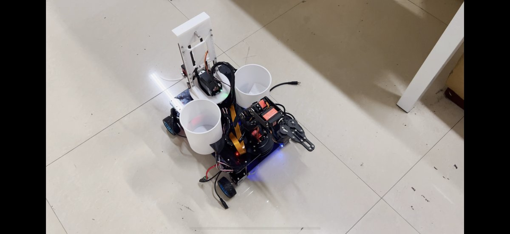
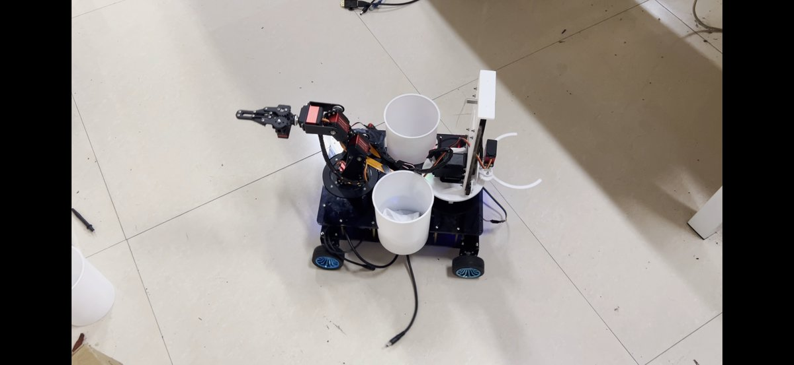
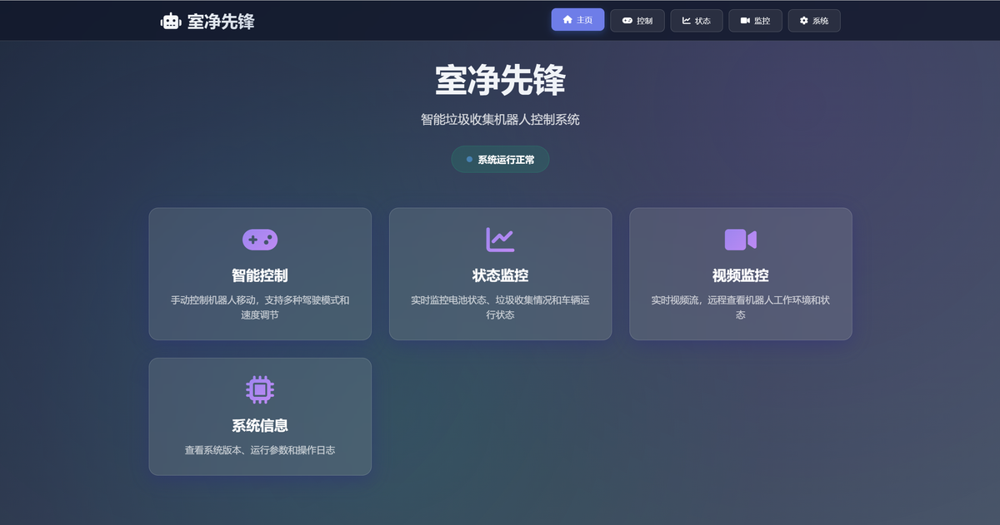
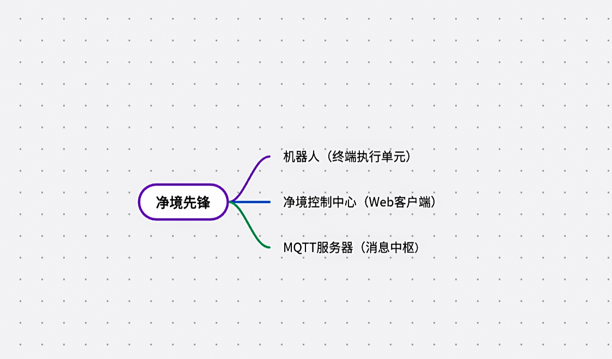
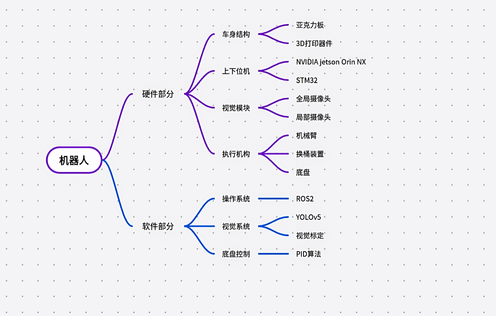
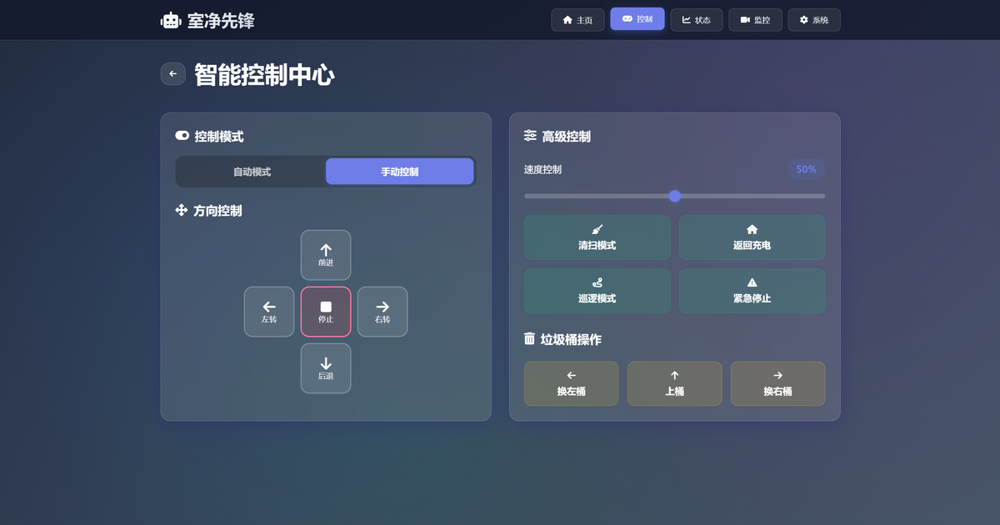
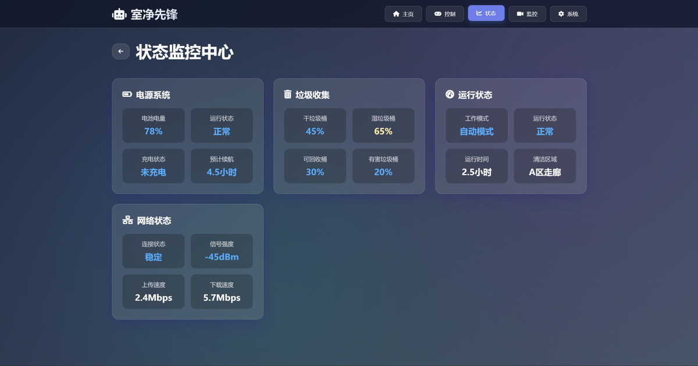
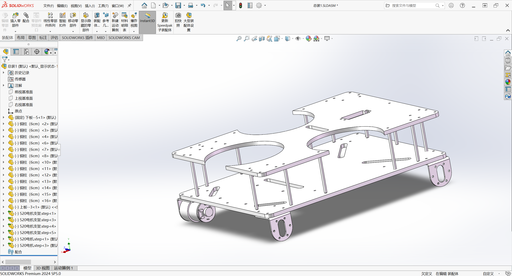
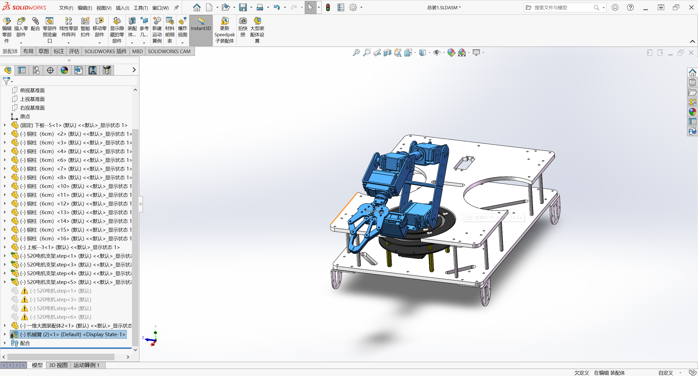
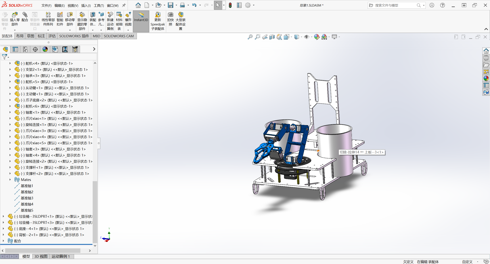

# 净境先锋 - 基于 ROS2 的智能垃圾拾取机器人

<p align="center">
  
  
</p>

基于 **NVIDIA Jetson Orin NX + STM32F103ZET6** 主从架构的智能垃圾拾取机器人，融合 ROS2 分布式通信、YOLOv5 目标检测、透视变换三维定位、4轴机械臂逆运动学抓取、MQTT 物联网通信及 Web 远程控制，实现垃圾的自主识别、分类抓取与云端管控全闭环。

**项目背景**：大学生物联网应用创新设计竞赛 / 大学生创新训练项目

## 系统界面

<p align="center">
  
  <br/>
  <sub>需要观看作品演示视频，可联系作者提供。</sub>
</p>


## 技术栈

| 层级 | 组件 | 职责 |
|------|------|------|
| 上位机 | NVIDIA Jetson Orin NX | ROS2 运行环境、AI 视觉推理、路径规划、任务调度 |
| 下位机 | STM32F103ZET6（FreeRTOS） | 电机 PID 闭环控制、舵机驱动、传感器采集、升降机构控制 |
| 视觉 | CSI 摄像头 x2（全局 + 局部） | 全局：大范围巡航垃圾搜索；局部：抵近后精准识别与三维定位 |
| 机械臂 | 自研 4 轴（4 舵机 + PCA9685） | 逆运动学解算，精准抓取垃圾并分类投放 |
| 通信 | UART 115200bps + MQTT (EMQX) | 上下位机通信 + 云端物联网数据通道 |
| 控制端 | Web 单页应用 | 状态监控、远程遥控、系统信息面板 |

## 系统架构

<p align="center">
  
  
</p>

系统采用**"端-管-云"**三层物联网架构：

```
┌─────────────────────────────────────────────────────────────────┐
│                    净境控制中心 (Web 客户端)                       │
│     状态监控  │  智能控制（自动/手动/高级）  │  系统信息            │
└──────────────────────────┬──────────────────────────────────────┘
                           │ MQTT (发布/订阅)
                    ┌──────┴──────┐
                    │ EMQX Broker │  ← Docker 部署
                    └──────┬──────┘
                           │ MQTT
┌──────────────────────────┴──────────────────────────────────────┐
│                     机器人终端 (Jetson + STM32)                   │
│                                                                  │
│  Jetson Orin NX (ROS2)                STM32F103 (FreeRTOS)      │
│  ├── 摄像头采集 (camera_publisher)     ├── 电机 PID 控制          │
│  ├── YOLOv5 检测 (yolo_detection)     ├── PCA9685 舵机驱动       │
│  ├── 透视变换 (perspective_service)    ├── MPU6050 姿态解算       │
│  ├── 目标确认 (detection_subscriber)   ├── 升降机构控制           │
│  ├── 机械臂 IK (arm_control)          ├── OLED 状态显示          │
│  └── 串口通信 (serial_send)  ←UART→   └── 串口命令解析           │
└─────────────────────────────────────────────────────────────────┘
```

## 核心功能

### 视觉识别与三维定位

- **YOLOv5 目标检测**：自定义数据集训练，GPU 加速推理，实时检测干/湿垃圾
- **透视变换定位**：相机标定 → 透视矩阵 → 2D 像素坐标精确映射为 3D 世界坐标
- **连续帧确认**：目标需连续 10 帧以上保持高置信度（>70%）才触发抓取，有效防止误操作

### 机械臂抓取

- **逆运动学解算**：4 轴串联臂（L1=15, L2=10.4, L3=9.1, L4=18.4 cm），余弦定理求解关节角度
- **平滑插值运动**：等步长关节插值（5°/步，100ms/步），确保运动平滑无冲击
- **自动分类投放**：根据 YOLO 识别结果，将垃圾投放至对应的干/湿垃圾桶

### 物联网远程控制

<p align="center">
  
  
</p>

- **状态监控**：电源系统、垃圾收集状态、运行模式、网络状态实时显示
- **智能控制**：自动模式（预设路径清扫）/ 手动模式（虚拟摇杆遥控）/ 高级控制（换桶/急停）
- **系统信息**：设备硬件信息、操作日志实时记录

### 自主维护

- 满溢检测：自动判断垃圾桶是否已满
- 自动换桶：导航至更换站，执行升降机构换桶流程
- 自动上桶：任务开始前从更换站自动装载空桶

## 3D 建模

<p align="center">
  
  
  
</p>

整机结构使用 SolidWorks 自主建模设计，亚克力板 + 3D 打印件，实现各电子元器件和执行机构的高度集成与定制化布局。

## 目录结构

```
rubbish_car/
├── interfaces/                   # ROS2 自定义消息与服务接口
│   ├── msg/                      # 自定义消息（BoundingBox, BoundingBoxArray）
│   └── srv/                      # 自定义服务（ArmControl, Perspective, Boolean, SendString）
├── robot_vision/                 # 视觉感知模块
│   ├── camera_publisher.py       # CSI 摄像头图像采集与 ROS2 话题发布
│   ├── yolo_detection.py         # YOLOv5 实时目标检测节点（CUDA 加速）
│   ├── perspective.py            # 透视变换服务：2D 像素坐标 → 3D 世界坐标
│   └── image_subscriber.py       # 图像订阅调试工具
├── robot_core/                   # 核心决策模块
│   ├── main_node.py              # 主节点入口，多线程执行器
│   ├── detection_subscriber.py   # 检测结果订阅与处理
│   ├── confirm.py                # 目标确认策略（连续帧 + 置信度阈值）
│   └── client.py                 # ROS2 服务客户端封装（机械臂/YOLO/透视变换）
├── robot_arm/                    # 机械臂控制模块
│   ├── arm_control.py            # 机械臂控制服务节点
│   ├── ik_service.py             # 逆运动学解算器（4轴）
│   ├── move_joints.py            # 关节平滑插值运动控制
│   └── client.py                 # ROS2 服务客户端封装
├── robot_serial/                 # 串口通信模块
│   ├── serial_send.py            # UART 发送服务节点
│   └── serial_receive.py         # UART 接收调试工具
├── robot_control/                # 控制指令模块
│   └── arm_send.py               # 机械臂 IK 计算 + 串口指令发送客户端
├── robot_launch/                 # ROS2 启动配置
│   └── launch/
│       ├── start.py              # 主启动文件（一键启动所有节点）
│       ├── arm.py                # 机械臂单独启动
│       └── yolo.py               # YOLO 检测单独启动
├── firmware/                     # 下位机固件（STM32F103ZET6 + FreeRTOS）
│   ├── Core/
│   │   ├── Src/
│   │   │   ├── main.c            # STM32 主程序
│   │   │   ├── motor.c           # 电机 PID 闭环控制
│   │   │   ├── pid.c             # PID 算法实现
│   │   │   ├── arm.c             # 舵机控制（机械臂）
│   │   │   ├── pca9685.c         # PCA9685 舵机驱动（I2C）
│   │   │   ├── lift.c            # 升降机构控制
│   │   │   ├── my_MPU6050.c      # MPU6050 姿态传感器
│   │   │   ├── transmit.c        # 串口命令解析与分发
│   │   │   ├── new-controls.c    # 运动控制逻辑
│   │   │   ├── oled.c            # OLED 显示驱动
│   │   │   └── ...               # HAL 外设初始化
│   │   └── Inc/                  # 头文件
│   ├── Middlewares/              # FreeRTOS 中间件
│   └── freertos_chuankou.ioc    # STM32CubeMX 工程配置
├── web/                          # Web 远程控制面板
│   └── index.html                # 单页应用（MQTT + 响应式 UI）
├── models/                       # 模型权重（已 gitignore，需单独下载）
├── media/                        # 项目展示图片
├── docs/                         # 项目文档
│   ├── system-design.md          # 系统设计说明
│   └── functional-requirements.md # 功能需求说明
├── .gitignore
└── README.md
```

## 硬件清单

| 硬件 | 型号/规格 | 用途 |
|------|-----------|------|
| 上位机 | NVIDIA Jetson Orin NX | ROS2 运行、AI 推理（GPU 加速） |
| 下位机 | STM32F103ZET6 | FreeRTOS 实时控制 |
| 摄像头 | CSI 摄像头 x2 | 全局搜索 + 局部精准识别 |
| 舵机驱动 | PCA9685（I2C） | 4 路舵机 PWM 生成 |
| 舵机 | x4 | 机械臂各关节驱动 |
| 姿态传感器 | MPU6050 | 机器人姿态检测 |
| 电机 | 直流减速电机 x4 + 编码器 | 差速驱动底盘 |
| OLED | 128x64（I2C） | 运行状态显示 |
| 结构件 | 亚克力板 + 3D 打印件 | SolidWorks 自主设计 |

## 快速开始

### 环境要求

- **上位机**：NVIDIA Jetson Orin NX，Ubuntu 20.04+，ROS2 Humble
- **下位机**：STM32CubeIDE（编译固件）
- **Python 依赖**：`ultralytics`, `opencv-python`, `pyserial`, `numpy`, `torch`

### 编译与运行

```bash
# 1. 编译 ROS2 工作空间
cd ~/robot_ws
colcon build

# 2. 加载环境
source install/setup.bash

# 3. 一键启动所有节点
ros2 launch robot_launch start.py
```

### 下位机固件

使用 STM32CubeIDE 打开 `firmware/freertos_chuankou.ioc`，生成 HAL 驱动后编译烧录。

### Web 控制面板

直接在浏览器中打开 `web/index.html`，配置 MQTT 服务器地址即可连接。

> **注意**：模型权重文件（`*.pt`）未包含在仓库中。如需运行视觉检测，请将训练好的 YOLOv5 权重放置到对应路径。

## 文档

| 文档 | 说明 |
|------|------|
| [docs/system-design.md](docs/system-design.md) | 系统设计说明（架构、硬件、软件、算法详解） |
| [docs/functional-requirements.md](docs/functional-requirements.md) | 功能需求说明（各模块功能定义） |
| [docs/uart-protocol.md](docs/uart-protocol.md) | UART 串口通信协议（上下位机命令格式） |
| [docs/deployment-guide.md](docs/deployment-guide.md) | 部署指南（环境配置、编译运行、固件烧录） |

## License

本项目为竞赛与大学生创新训练项目作品，仅供学习参考。
